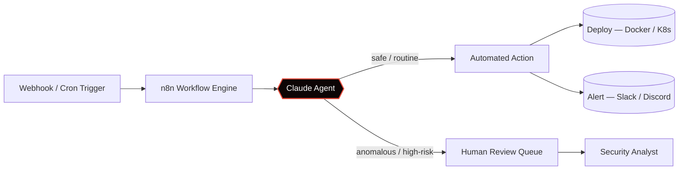

<div align="center">

```
~/github/ItzFaLL3n $ whoami
```

# FaLL3n
**Backend Developer · Cloud Security · Container Alchemist**

[](https://git.io/typing-svg)

<br/>

[](https://github.com/ItzFaLL3n)
[](https://discord.gg/E834WAy32g)
[](#)


</div>
<br/>

---

### `01` — init

```yaml
name:       FaLL3n
location:   "somewhere in the cloud"
focus:      Cloud Security · Backend Architecture · Containers · AI-Driven Automation
building:   Secure, scalable systems — one container at a time.
ai_ops:     Claude as the reasoning layer, n8n as the nervous system.
fun_fact:   "I don't patch vulnerabilities. I have long talks with them."
```

---

### `02` — arsenal

<div align="center">

**Languages**
<br/>


<br/><br/>

**Cloud & Infrastructure**
<br/>


<br/><br/>

**Containers & Orchestration**
<br/>


<br/><br/>

**AI & Automation**
<br/>


</div>

> Claude reasons over the workflow. n8n orchestrates it. Together they replace a good chunk of what used to be manual triage — webhook events get classified, enriched, and routed before a human ever sees them.

---

### `03` — pipeline

The shape of most things I ship right now: an event comes in, an agent decides what it means, and only the ambiguous cases reach a person.



Same pattern, different faces: CI/CD gatekeeping, log-anomaly triage, or a WhatsApp/Slack bot that only escalates when the model isn't confident.

---

### `04` — tools & infrastructure

<div align="center">

<table>
<tr>
<td align="center" width="80"><br/><sub>Docker</sub></td>
<td align="center" width="80"><br/><sub>Kubernetes</sub></td>
<td align="center" width="80"><br/><sub>AWS</sub></td>
<td align="center" width="80"><br/><sub>Nginx</sub></td>
<td align="center" width="80"><br/><sub>Node.js</sub></td>
<td align="center" width="80"><br/><sub>MongoDB</sub></td>
<td align="center" width="80"><br/><sub>MySQL</sub></td>
<td align="center" width="80"><br/><sub>Git</sub></td>
<td align="center" width="80"><br/><sub>Neovim</sub></td>
</tr>
</table>

</div>

---

### `05` — stack

<div align="center">

**Cloud & Security**
<br/>


<br/>


<br/>


<br/><br/>

**Backend & DevOps**
<br/>


<br/>


<br/>


</div>

---

### `06` — AI-assisted development

<div align="center">

<table>
<tr>
<td align="center" width="110">
<br/>
<sub>Agentic coding</sub>
</td>
<td align="center" width="110">
<br/>
<sub>Code completion</sub>
</td>
<td align="center" width="110">
<br/>
<sub>AI-first editor</sub>
</td>
<td align="center" width="110">
<br/>
<sub>UI generation</sub>
</td>
</tr>
<tr>
<td align="center" width="110">
<br/>
<sub>Research</sub>
</td>
<td align="center" width="110">
<br/>
<sub>AI IDE</sub>
</td>
<td align="center" width="110">
<br/>
<sub>Ideation</sub>
</td>
<td align="center" width="110">
<br/>
<sub>AI search</sub>
</td>
</tr>
</table>

</div>

---

### `07` — connect

<div align="center">

[](https://github.com/ItzFaLL3n)
[](https://discord.gg/E834WAy32g)

<sub>Open to conversations about container security, backend architecture, and AI-driven ops.</sub>

<br/><br/>

[](https://github.com/FaLL3nWhizzy)
[](https://discord.gg/E834WAy32g)

<br/>

<sub>© FaLL3n — patched systems, unpatched curiosity.</sub>
<br/>
<sub>built with claude code & caffeine · secured before shipped</sub>

</div>

---

### `08` — github stats

<div align="center">


<br/><br/>


<br/><br/>


</div>
